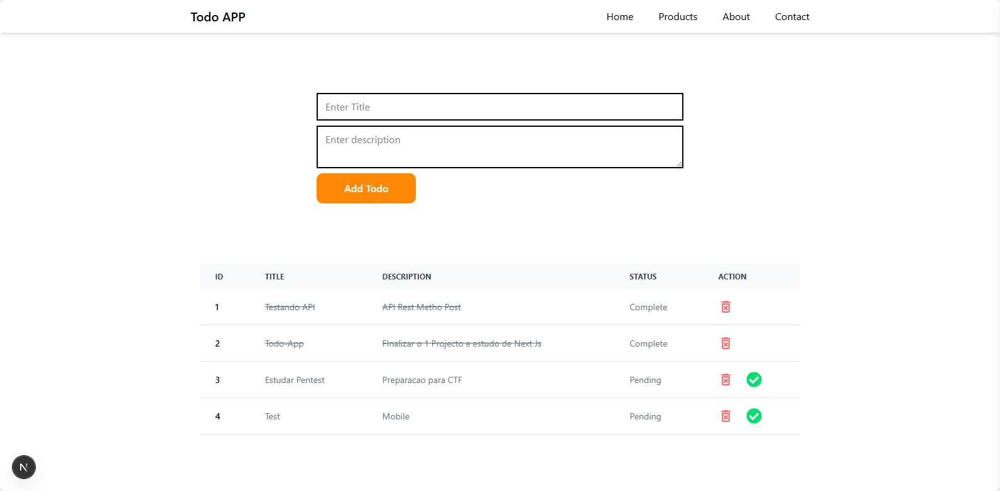

<h1 align="center">📝 Todo App</h1>

<p align="center">
  Uma aplicação web simples de lista de tarefas (Todo App), desenvolvida com <strong>Next.js</strong>, que permite aos usuários adicionar, editar e remover tarefas do dia a dia de forma prática e rápida.
</p>

<p align="center">
  <a href="#-tecnologias">Tecnologias</a>&nbsp;&nbsp;|&nbsp;&nbsp;
  <a href="#-funcionalidades">Funcionalidades</a>&nbsp;&nbsp;|&nbsp;&nbsp;
  <a href="#-como-executar">Como Executar</a>&nbsp;&nbsp;|&nbsp;&nbsp;
  <a href="#-layout">Layout</a>&nbsp;&nbsp;|&nbsp;&nbsp;
  <a href="#-licença">Licença</a>&nbsp;&nbsp;|&nbsp;&nbsp;
</p>

<p align="center">
  
</p>

---

## 🚀 Tecnologias

Este projeto foi desenvolvido com as seguintes tecnologias:

- [Next.js](https://nextjs.org/)
- [React](https://reactjs.org/)
- [JavaScript (ES6+)](https://developer.mozilla.org/pt-BR/docs/Web/JavaScript)
- [CSS Modules](https://nextjs.org/docs/basic-features/built-in-css-support)
- [Vercel (Deploy)](https://vercel.com/)
- Git e GitHub

---

## ✅ Funcionalidades

- [x] Adicionar nova tarefa
- [x] Marcar tarefa como concluída
- [x] Editar tarefa
- [x] Excluir tarefa
- [x] Interface limpa e responsiva

---

## ▶️ Como Executar

Para clonar e rodar o projeto localmente:

```bash
# Clone o repositório
git clone https://github.com/seu-usuario/todo-next-app.git

# Acesse a pasta do projeto
cd todo-next-app

# Instale as dependências
npm install

# Inicie o servidor de desenvolvimento
npm run dev

# A aplicação estará disponível em http://localhost:3000.
```

---

## 🎨 Layout
Este projeto segue um layout simples e limpo, ideal para iniciantes aprenderem Next.js com foco em CRUD.

Você pode customizar facilmente a interface editando os ficheiros .module.css.

---

## 📝 Licença
Este projeto está sob a licença MIT.
Feito por Keiser Augusto Manuel

---

## 📌 Notas
Este projeto foi criado com fins educativos e pode ser utilizado como base para aplicações mais completas que integrem back-end com banco de dados.
